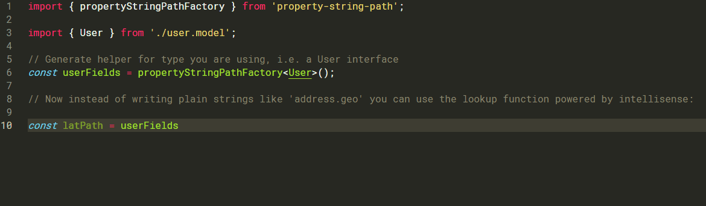

# property-string-path

## Well, what is it?

A micro utility for obtaining string paths to object properties, i.e. get string `'address.geo.lat'` to represent nested latitude property of an interface:

```typescript
interface SomeInterface {
  address: {
    geo: {
      lat: string;
    };
  };
}
```

## What's the use case?

You have a large form based on a humongous interface that has deep nesting and you want to avoid shooting your feet by setting form inputs as plain strings. Originally I came up with this solution to use it for input names in `react-hook-form`, but it basically can be used anywhere where a string representing a path to object's property is required, i.e. can as well use it with Angular's `FormGroup.get` method to get a deeply nested control.

## Installation

```bash
npm i property-string-path
```

## Usage

Let's suppose we have an interface representing a user:

```typescript
// user.model.ts

export interface User {
  id: number;
  name: string;
  username: string;
  email: string;
  address: Address;
  phone: string;
  website: string;
  company: Company;
}

export interface Address {
  street: string;
  suite: string;
  city: string;
  zipcode: string;
  geo: Geo;
}

export interface Geo {
  lat: string;
  lng: string;
}

export interface Company {
  name: string;
  catchPhrase: string;
  bs: string;
}
```

Import the factory for creating generating the lookup function, and obsiously the interface you will be basing your form on.

```typescript
import { propertyStringPathFactory } from 'property-string-path';

import { User } from './user.model';

// Generate helper for type you are using, i.e. a User interface
const userFields = propertyStringPathFactory<User>();
```

Now instead of writing plain strings like 'address.geo' you can use the lookup function powered by intellisense:


### More examples

[Using with Angular Reactive Forms](https://github.com/Bwca/package-testing-monorepo/blob/master/property-string/ng-prop-string/src/app/app.component.ts)  
[Using with React Hook Form](https://github.com/Bwca/package-testing-monorepo/blob/master/property-string/cra-prop-string/src/App.tsx)
